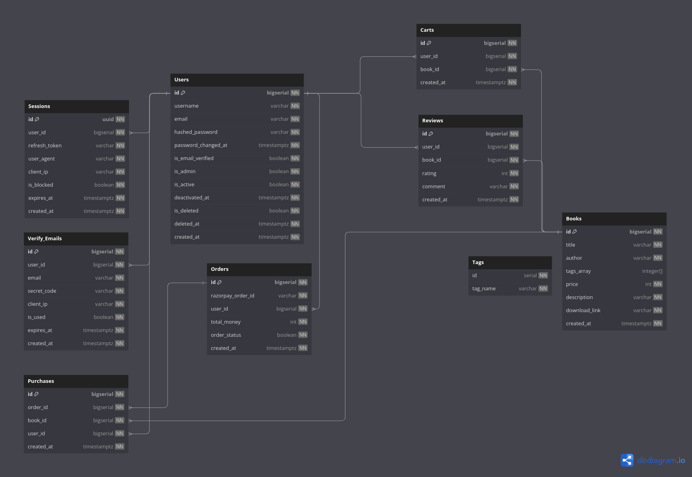

# Book store using ServiceNow
Built a book store for a client using ServiceNow which has 
- User authentication
- Fuzzy searching using natural language processing
- CRUD operations for managing books inventory
- Razorpay integration for online payements

## Salient Features

### Combination of Hexagonal and Onion Architecture (DDD)
My code is highly decoupled. This is possible because I have used `ports and adapters architecture` throughtout my code base(basically different interfaces for different jobs). Took some inspiration from the `onion architecture` to build my logging service completly detached from my bussiness logic and to make middlewares for my json api 

- Power of `ports and adapter architecture` (high level overview)


- Power of `onion architecture` (high level overview)


### Background Workers
I wrote the `background workers from scratch` for the task which should not block the user to further request my api (eg:- while email is sent to user and when user deleted their account). I have used `semaphore` to make a simple task queue for my worker. You can see the power of background workers here

- Working of email background worker for `email verification`

[email_worker.webm](./public/email-background-worker.webm)


- Working of deletion operation in background to support `soft delete`


### Search and Filtering with NLP in Postgres 
I have made a complete `fuzzy search` implementation using NLP in postgres. Uses `stop word removal`, `lexeme` formation and `similarity match` in postgres to rank the results and give it to users. You can see some eaxmple below but please try out the search yourself to see its true magic


The query that went into this goes like this. I know this maybe unoptimized but I am open to learn 
```sql
WITH book_search_cte AS (
    SELECT
        b.id,
        b.title,
        b.author,
        array_agg(t.tag_name) AS tags_array,
        r.average_ratings AS ratings,
        b.description
    FROM "Books" AS b
    LEFT JOIN "Tags" AS t ON t.id = ANY(b.tags_array)
    LEFT JOIN (
        SELECT book_id, AVG(rating) AS average_ratings FROM "Reviews"
        GROUP BY book_id
    ) AS r ON r.book_id = b.id
    GROUP BY b.id, b.title, b.author, r.average_ratings, b.description
), 
final_cte AS (
  SELECT *,
    ts_rank(
      to_tsvector('english', title) || ' ' ||
      to_tsvector('english', author) || ' ' ||
      setweight(to_tsvector('english', array_to_string(COALESCE(tags_array, '{}'), ' ')), 'A') || ' ' ||
      to_tsvector('english', description),
      websearch_to_tsquery('english', $1)
    ) AS ranks,
    difference(array_to_string(COALESCE(tags_array, '{}'), ' '), $2) AS tags_difference,
    difference(title, $2) AS title_difference,
    difference(author, $2) AS author_difference,
    difference(description, $2) AS description_difference
  FROM book_search_cte
)
SELECT *,
  GREATEST(title_difference, author_difference, description_difference, tags_difference) AS max_difference
FROM final_cte
ORDER BY ranks DESC, max_difference DESC, tags_difference DESC, title_difference DESC, author_difference DESC, description_difference DESC
LIMIT $3
OFFSET $4;
```

### Razorpay Integration
Complete razorpay integration for orders. Operational flow is like


1. Add books to cart

[Screencast from 02-09-23 07:46:57 PM IST.webm](./public/add-book.webm)

2. Place order

[Screencast from 02-09-23 07:49:03 PM IST.webm](./public/place-order.webm)

3. Verify Order


## Operational Flow


You can test the api routes through this `postman` link
```
https://www.postman.com/mission-physicist-26981670/workspace/balkanid-book-store
```

## System Design

### Infrastructure


### Database Design



## Code Maintainability and Support 

1. How would you get to know from where has the error come from ? To solve this I have created a structured logging system in which you can `trace user-id` and even trace the function calls
 

2. Lets say there something wrong with the json transport layer that is, our gateway service/api. In that case you just need to change the code in the `api folder` and literlly dont care about rest of the code. This is because interfaces are used which creates a contract between different parts of the code. So basically the function name remains the same its functionality you can change anytime. Similarly if there is any error in the auth or book manamement logic then check in the `authService` or `bookService` folder.

3. All of my errors are declared in `erros.go` handled in a  `middleware` to make it organized.


 
4. Rest of the folders like `database`, `email`, `token` and `worker` all can be think of as a external tool(adapters) and are independent in themselves. So if you need to use these tools then just do like this
```
type authManager struct {
	config     util.Config
	tokenMaker token.Maker
	db         database.Storer
	worker     worker.Worker
}
``` 


## Tasklist
- [X] Secure user registration and authentication
- [X] Account Deactivation and Deletion: Allow users to deactivate or delete their accounts, if applicable. Implement a mechanism to handle account deletion securely while considering data retention policies.
- [X] Protection against vulnerabilities like SQL injection attacks
- [X] Have Proper system logging with retention policies upon system failure
- [X] Users can easily search and filter books and add them to shopping cart
- [X] Users can easily download their bought books and leave a review on the books they bought
- [X] Admins have the ability to manage inventory and others
- [X] Make the necessary APIs to expose
- [X] SQL based database - PostgreSQL
- [X] Use a reverse-proxy of your choice
- [X] You can choose to write your program in Golang only. It is crucial to ensure that your code is well organized and easy to understand, and that you provide clear instructions on how to run your program.
- [X] All plagiarized submissions will be disqualified. Please ensure that you use a VCS Platform like Github and commit and push all your contributions on time. Kindly share the same.
- [X] The Github repository must have a file called “README.md” which contains information about how to install and run your project, along with a clear understanding of your project, including relevant diagrams, if any. If you have deployed your application, you may include a link in the README.
- [X] You can use Docker and containerize your application code to run, including the database
- [X] You can test your code by adding unit test cases and workflow test cases
- [X] You can add recommendation system to recommend books to user
